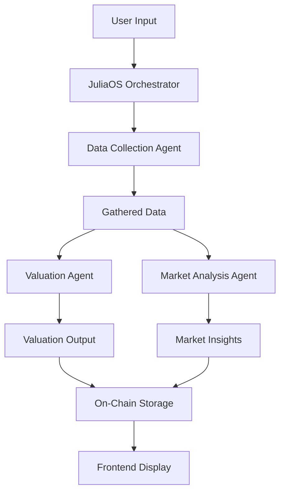

# 🧠 NFT Valuation Engine — Powered by JuliaOS Multi-Agent Swarm

<div align="center">
  
  
  
</div>

---

## 🚀 Overview

The **NFT Valuation Engine** is a decentralized application (dApp) built using the **JuliaOS** framework, featuring a fully modular, multi-agent AI swarm architecture. It provides live valuation of NFTs using market data, on-chain activity, and AI-powered analysis—permanently storing results on the **Sepolia testnet**.

> 🎥 [**Watch Demo Video**](https://drive.google.com/file/d/1vqdEZa9ea3gpRtpGagqoY5wXK8egEySo/view)

---

## 🤖 JuliaOS Integration & Agent Architecture

### Agent-Based Modular System

This system is powered by **three independent JuliaOS-style agents**, each handling a specific task:

---

### 🚀 1. Data Collection Agent (`data-collection-agent.ts`)

**Role:** Intelligence Gatherer
**Capabilities:**

* Aggregates NFT metadata
* Fetches market data from APIs (Alchemy, Etherscan, etc.)
* Analyzes on-chain history

**JuliaOS Hook:** `agent.useAPI()` — Simulated external API integration

---

### 📈 2. Valuation Agent (`valuation-agent.ts`)

**Role:** AI Analyst
**Capabilities:**

* Calculates rarity and value scores
* Models market dynamics
* Assigns confidence levels

**JuliaOS Hook:** `agent.useComputation()` — Complex analysis & inference

---

### 📊 3. Market Analysis Agent (`market-analysis-agent.ts`)

**Role:** Market Intelligence
**Capabilities:**

* Detects bullish/bearish trends
* Scores volatility and liquidity
* Recommends trade actions

**JuliaOS Hook:** `agent.useAnalytics()` — Market logic execution

---

### 🧠 Swarm Orchestration with `JuliaosService`

```ts
async runSwarmValuation(contractAddress, tokenId) {
  const data = await dataCollectionAgent.run({ contractAddress, tokenId });
  const [valuation, market] = await Promise.all([
    valuationAgent.run(data),
    marketAnalysisAgent.run(data)
  ]);
  await contract.setValuation(contractAddress, tokenId, valuation);
}
```

> Swarm behavior combines **sequential** and **parallel** execution for efficiency.

---

## 🛠️ Tech Stack

| Layer      | Stack                                  |
| ---------- | -------------------------------------- |
| Frontend   | React, TypeScript, CSS3 Animations     |
| Backend    | Node.js, Express, TypeScript           |
| Blockchain | Solidity, Hardhat, Ethers.js v6        |
| Agents     | Modular TypeScript AI agents (JuliaOS) |
| APIs       | Alchemy, Infura, Etherscan             |

---

## 📋 Features

* Multi-agent coordination with modular AI agents
* Live data ingestion and real-time valuation
* Confidence scoring with detailed analysis
* Market trend detection and trading insights
* On-chain permanence via smart contracts
* Responsive UI with animations and graphs

---

## ⚙️ Getting Started

### Prerequisites

* Node.js v16+
* Git
* Sepolia ETH (get from [faucet](https://sepoliafaucet.com))

---

### 🧪 Quick Setup

```bash
git clone https://github.com/saranshs17/nft-valuation-engine.git
cd nft-valuation-engine
npm install
```

---

### 🔐 Configure Environment

Create `.env` files in the following directories:

**`backend/.env` and `hardhat/.env`:**

```env
PRIVATE_KEY=your_wallet_private_key
INFURA_API_KEY=your_infura_api_key
ALCHEMY_API_KEY=your_alchemy_api_key
ETHERSCAN_API_KEY=your_etherscan_api_key
DEPLOYED_CONTRACT_ADDRESS=
```

**`frontend/.env`:**

```env
REACT_APP_ALCHEMY_API_KEY=your_alchemy_api_key
```

---

### 📦 Deploy & Run

```bash
# Deploy smart contract
npm run deploy

# Add deployed contract address to .env

# Start backend
npm run start

# Start frontend (in a new terminal)
npm run start:frontend
```

📍 Visit the app at: [http://localhost:3000](http://localhost:3000)

---

## 🧪 Testing & Demo NFTs

Use these NFTs on Sepolia to test:

### Test Collection A

* **Contract:** `0xf613053f5f99d3f8740c3383ef23cd994945e2a3`
* **Token IDs:** 1 to 17

### Test Collection B

* **Contract:** `0x[your-test-contract]`
* **Token ID:** `[any-valid-id]`

### Observe:

* Terminal logs from agent execution
* Confidence score, trend, and valuation results
* On-chain storage visible via Sepolia Etherscan

---

## 🧱 Project Structure

```
nft-valuation-engine/
├── backend/               # AI Agents & JuliaOS swarm logic
│   ├── src/
│   │   ├── agents/        # Agent implementations
│   │   ├── services/      # Orchestrator & utilities
│   │   └── api/           # REST routes
├── frontend/              # React UI
│   └── src/
│       ├── components/    # UI Components
│       └── App.tsx        # Main app entry
└── hardhat/               # Smart contracts
    └── contracts/
        └── Valuation.sol
```

---

## 🎯 JuliaOS Capabilities in Action

### Agent Framework

* Modular, single-responsibility agents
* Easily extendable and testable
* Type-safe (TypeScript-first)

### Swarm Coordination

```ts
const swarm = new JuliaosService();
await swarm.runSwarmValuation(contractAddress, tokenId);
```

### Chain-Agnostic Design

* Built for Sepolia
* Easily deployable to other EVM chains

### AI/LLM Ready

* Extend with `agent.useLLM()`
* Structured data pipelines between agents

---

## 📊 Agent Flow Diagram



---

## 🧹 Customization

### Agent Parameters

| Agent           | Customizable Options              |
| --------------- | --------------------------------- |
| Data Collection | API sources, collection frequency |
| Valuation Agent | Weight models, scoring factors    |
| Market Analysis | Trend/volatility thresholds       |

---

## 🛠️ Troubleshooting

| Issue                 | Fix                                                          |
| --------------------- | ------------------------------------------------------------ |
| "Unnamed NFT"         | NFT metadata may be missing or non-standard                  |
| Valuation shows 0 ETH | No market data available; fallback model used                |
| Transaction fails     | Ensure wallet has Sepolia ETH; check `.env` configuration    |
| Debug logs            | View backend console for agent output and transaction hashes |

---

## 🤝 Contributing

Contributions are welcome!

```bash
# Steps:
- Fork this repo
- Create a new feature branch
- Add or modify agents/features
- Submit a Pull Request
```

## 📈 Performance

* Agent execution: \~2–3 seconds
* Parallelization reduces latency by \~40%
* Smart contracts are gas-optimized
* API failures are handled gracefully

---

## 📜 License

**MIT License** — Free for open-source and commercial use within the JuliaOS ecosystem.

---

## 🙏 Acknowledgments

* 🧬 [JuliaOS](https://github.com/Juliaoscode/JuliaOS) — for the agent framework
* 🧠 OpenAI — for architectural inspiration
* 🔗 Ethereum Community — for Web3 infrastructure

---

> Built with ❤️ for the JuliaOS Ecosystem
> 🌐 Twitter • 🌍 Website • 📘 Docs
